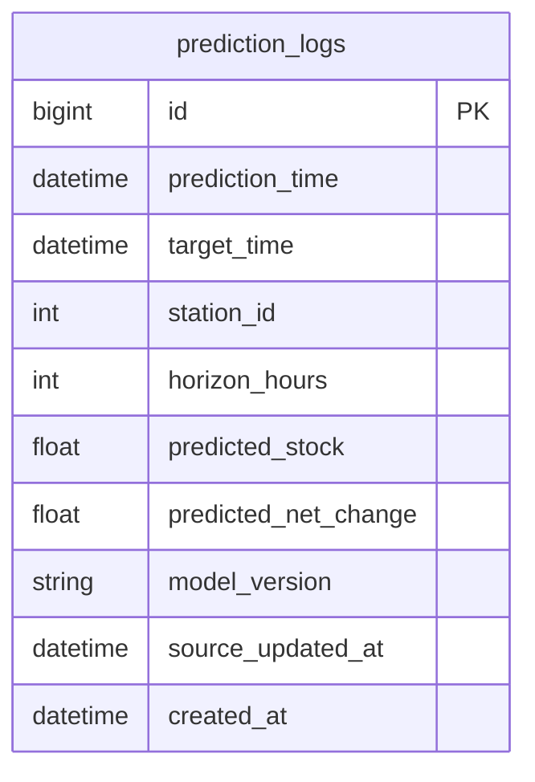

# DDRI 최소 ERD

작성일: 2026-03-19  
목적: 현재 서비스 기준의 최소 영속 구조를 관계 중심으로 정리한다.

## 1. 현재 ERD 해석

현재 웹서비스는 무상태 운영도 가능하다.  
즉, 아래 두 가지 중 하나로 볼 수 있다.

1. DB 없음
2. 예측 로그만 저장하는 최소 DB

현재 ERD는 2번을 기준으로 정의한다.

## 2. 엔터티 목록

- `prediction_logs`

## 3. 관계 설명

- 현재 최소 ERD에는 핵심 참조 관계가 없다.
- 스테이션 마스터는 DB 테이블이 아니라 로컬 마스터 데이터로 취급한다.
- 실시간 재고와 날씨는 외부 API에서 조회한다.

## 4. 텍스트 ERD

```text
prediction_logs
 - id PK
 - prediction_time
 - target_time
 - station_id
 - horizon_hours
 - predicted_stock
 - predicted_net_change
 - model_version
 - source_updated_at
 - created_at
```

## 5. Mermaid ERD



## 6. 현재 제외한 엔터티

아래 항목은 현재 ERD에서 제외한다.

- `stations`
- `station_api_mappings`
- `realtime_station_stock`
- `station_demand_forecasts`
- `station_risk_snapshots`
- `statistics_snapshots`
- `users`
- `favorites`

이유:

- 정적 기준 정보는 로컬 데이터로 처리
- 실시간 데이터는 외부 API 기준
- 저장 기능이 없는 조회형 웹
- 통계 및 사용자 기능이 현재 범위 밖

## 7. 향후 확장 가능성

아래 요구가 생기면 ERD를 다시 확장한다.

- 예측 로그 장기 보관
- 운영 정책 저장
- 관리자 설정 수정
- 통계 집계 저장
- 사용자 계정/권한 도입

현재 단계에서는 위 확장을 미리 테이블로 만들지 않는다.
